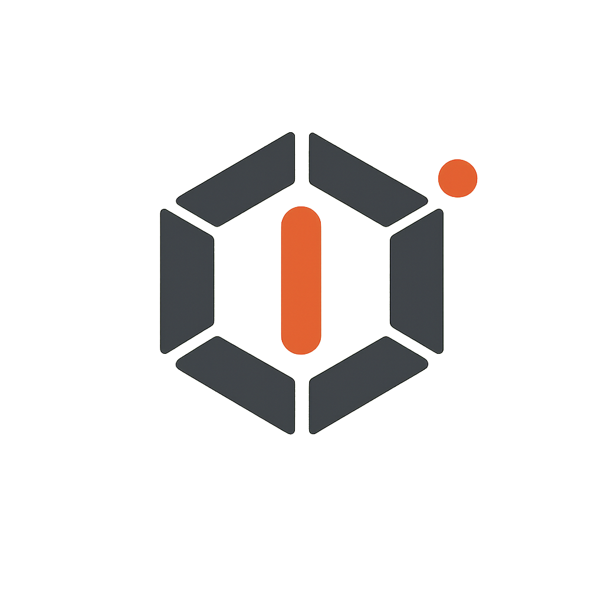

<p align="center"></p>

# Rod

Rod is an **authorized-use red-team command-and-control (C2) platform** for
red-team operations, penetration tests, and security research. A team of
operators drives a fleet of short-lived, disposable implants on authorized
targets from a central teamserver, reaching hosts behind NAT and firewalls over
implant-initiated connections.

> **Status: the framework is implemented; sensitive tradecraft is out-of-tree.**
> The teamserver, reference implant, build pipeline, operator UI, and durable
> state are in place across the six internal layers. The capability contracts
> are wired and dispatched; the reference implant runs the standard, documented
> category (shell, file transfer, recon, lateral, persist, collect, exfil), while sensitive
> tradecraft -- exploits, evasion, LSASS dumping, keyboard capture -- is
> supplied as separate, opt-in modules against the same contracts
> (architecture.md Sec 13). See [docs/architecture.md](docs/architecture.md) for
> the blueprint and [docs/todo.md](docs/todo.md) for open work.

---

## IMPORTANT: authorized use only

Rod is remote-code-execution infrastructure. It must **only** be used against
systems and networks you own or are **expressly authorized** to test. Unauthorized
use is illegal in most jurisdictions. Before you use any of this, read
[RESPONSIBLE-USE.md](RESPONSIBLE-USE.md).

---

## What it is

Rod is a red-team C2 built from operational needs, not from a device-management
model. An operation is isolated per **Engagement**, with disposable
infrastructure, per-implant OPSEC, and an audit trail that is the source for the
final report.

- **Teamserver** -- a monolithic .NET 10 control-plane kernel with six internal
  layers: core state, transport, payload build pipeline, operator layer, storage
  and audit, and pluggable tradecraft.
- **Build units** -- per-language units driven by the teamserver through a
  uniform, language-neutral build contract. .NET ships in-tree; Go, C/C++, and
  Nim arrive as out-of-tree community units against the same contract, so
  implants stay polyglot without coupling them to the teamserver language.
- **Implants** -- short-lived, disposable payloads on targets, untrusted by
  default, each with a unique key and a profile (beacon parameters, kill date,
  transport shape) baked in at generation.
- **Redirectors** -- near-stateless forwarders that front listeners for OPSEC and
  infrastructure flexibility; the in-tree direction is a .NET Native AOT single
  binary, and burned redirectors are swappable.
- **Operator UI** -- the web front end operators use to run an engagement.

Operations are organized around an **Engagement** -- the unit of tenancy,
isolation, authorization, and evidence. Implants enrol into exactly one
engagement; all data, tasking, artifacts, and audit records are
engagement-scoped. Cross-engagement access is impossible by construction.

## Design goals

- **Designed for the red-team lifecycle**: infrastructure stand-up, payload
  generation, beaconing, post-exploitation, lateral movement, exfiltration, and a
  report/evidence deliverable.
- **OPSEC as a first-class axis**: per-implant beacon profiles with jitter, kill
  dates, per-implant keys, malleable transport profiles, and disposable
  infrastructure.
- **Polyglot implants from one control plane**: a .NET teamserver driving a .NET
  reference implant, with the language-neutral build contract open to out-of-tree
  Go, C/C++, or Nim implants for targets .NET does not fit.
- **Make the protocol the product**: a stable, language-neutral, transport-
  agnostic contract so implants can be implemented independently in whatever
  language fits the target.
- **Operation isolation and evidence**: per-engagement isolation, multiplayer
  collaboration with attributed actions (every event records the operator who
  acted), and a complete, tamper-evident audit trail that is the source for the
  final report.

## Non-goals

- Rod commands authorized targets; it is not a general-purpose PaaS or
  orchestration platform.
- Delivery (phishing, host interaction, etc.) is out of scope; Rod ingests the
  first callback and correlates it to the engagement.
- Detection-evasion and exploit behavior are **pluggable capability contracts**:
  the core defines their interfaces and dispatch and provides no concrete bypass
  techniques or in-the-wild PoCs; tradecraft lives in separate, opt-in modules.

## Technology

| Component | Stack | Notes |
|-----------|-------|-------|
| Teamserver | .NET 10 (LTS), ASP.NET Core, gRPC | Monolithic kernel, six internal layers. |
| Data store | PostgreSQL (opt-in) | Authoritative state and per-engagement audit when `ConnectionStrings:Postgres` is set; in-memory and file-backed stores are the defaults. |
| Build units | .NET (in-tree); Go/C/C++/Nim out-of-tree | One in-tree toolchain; polyglot by contract, no teamserver-language coupling (architecture.md Sec 12.2). |
| Redirectors | .NET Native AOT, single static binary | Tiny VPS footprint, no runtime install; burned redirectors swappable (architecture.md Sec 8). |
| Implants | .NET (reference); Go/C/C++/Nim out-of-tree -- per target | Short-lived, disposable, per-implant keys. |
| Operator UI | Web (React) | Lives in the teamserver project; served same-origin. |

See [docs/architecture.md](docs/architecture.md) for the rationale behind these
choices.

## Getting started

Prerequisites: .NET SDK 10 (pinned in `global.json`) and Node.js 22.12+ for the
operator UI.

```
dotnet build Rod.slnx     # builds the teamserver and the operator UI (wwwroot)
dotnet run --project src/teamserver/Rod.TeamServer
```

The teamserver starts on the default dev listener `http://127.0.0.1:5080`; the
operator UI is served at the same origin. The first operator account is seeded
from the `Operators` configuration section (see `appsettings.json`); log in at
the UI and create an engagement, mint a stager token, and enroll the reference
implant (`src/implant/dotnet`, run it with `-enroll-url ... -token ...`).

Configuration is opt-in sections of `appsettings.json`:

- `ConnectionStrings:Postgres` -- durable teamserver state (PostgreSQL).
- `Audit:DataDirectory` -- file-backed audit trail, artifacts, and built
  payloads that survive a restart.
- `Pki` -- an externally provisioned engagement CA (PEM cert + key) for implant
  enrollment; omit for the dev self-signed CA.
- `Listeners` -- C2 ingress (HTTP(S) and mTLS transports).

## Documentation

Start here:

- **[docs/architecture.md](docs/architecture.md)** -- the system blueprint:
  operational lifecycle, the engagement model, the monolithic-kernel layers,
  implants and profiles, the build pipeline, OPSEC, transports, security, and the
  sensitive-capability boundary.
- **[docs/todo.md](docs/todo.md)** -- open work.
- **[docs/glossary.md](docs/glossary.md)** -- terminology.
- **[docs/operations/redirectors.md](docs/operations/redirectors.md)** -- the
  redirector build/deploy/rotate runbook.
- **[SECURITY.md](SECURITY.md)** -- vulnerability reporting and scope.

## License

Licensed under the [Apache License, Version 2.0](LICENSE).
