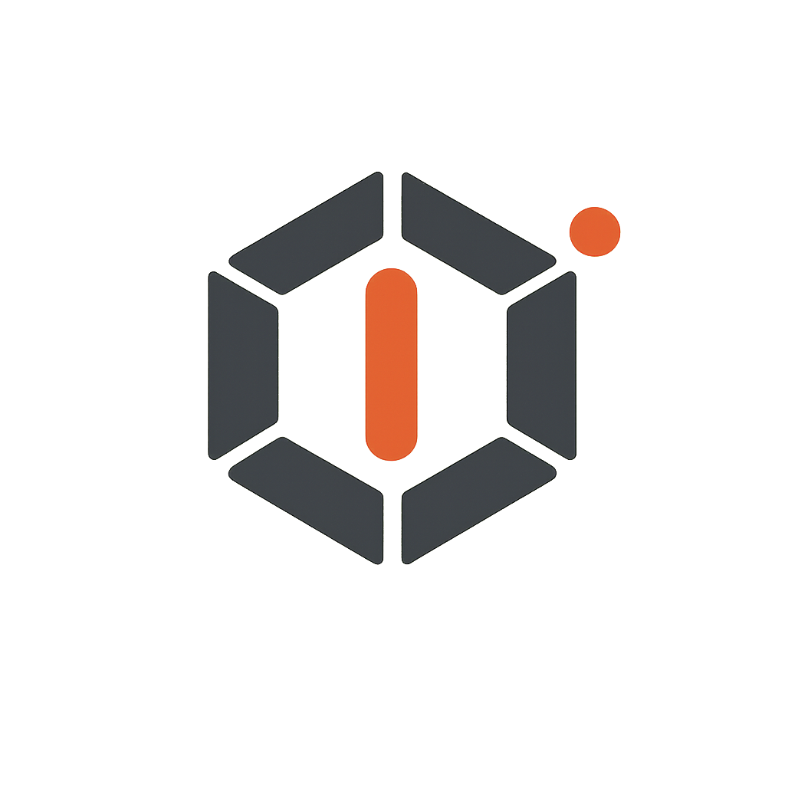
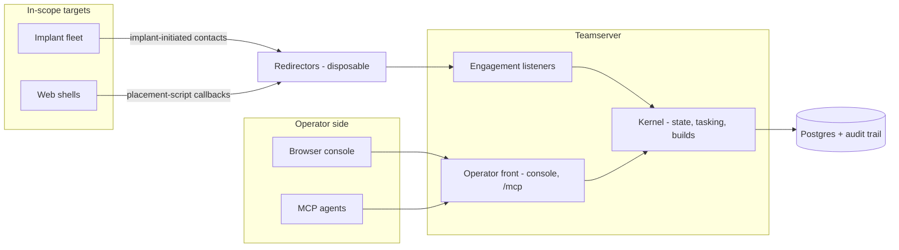

<p align="center"></p>

<h1 align="center">Rod</h1>

<p align="center">
  An <b>authorized-use red-team operations platform</b> for penetration
  tests and security research.<br>
  Pre-foothold recon, one teamserver, a fleet of disposable implants
  reaching hosts behind NAT and firewalls over implant-initiated
  connections --<br>
  and an audit trail that becomes the report.
</p>

<p align="center">
  <a href="https://github.com/Nonprofessional/Rod/actions/workflows/ci.yml"></a>
  
  
  
  <a href="LICENSE"></a>
</p>

> **Authorized use only.** Rod is remote-code-execution infrastructure. It
> must **only** be used against systems and networks you own or are
> **expressly authorized** to test. Unauthorized use is illegal in most
> jurisdictions.

> **Status: implemented; sensitive tradecraft is out-of-tree.** The
> teamserver, reference implant, build pipeline, operator UI, and durable
> state are in place. The reference implant runs the compiled core (shell
> execution one-shot and interactive, file transfer both ways, directory
> listing, process termination, beacon retiming, tunneling, the module
> family -- load/list/unload, memfd-exec on Linux -- and the Windows-gated
> sensitive trio: shellcode injection, LSASS minidump, input capture), while
> the long tail (recon sweeps, lateral movement, persistence, credential
> and screen collection) and the exploit/evasion categories arrive through
> the extension seams as separate opt-in modules
> ([architecture.md Sec 13](docs/architecture.md)). Operator-side, the
> external recon workbench ships pre-foothold scoping -- passive
> RDAP/CT/DoH/whois lookups and an ROE-gated port scan whose findings land
> as engagement artifacts
> ([docs/operations/recon.md](docs/operations/recon.md)).

## What you get

- **Five transports, one task grammar.** `http`, `https`, `dns`, `tcp`,
  and `doh` listeners ship in-tree; every verb works
  over every carrier, with live channels on the stream transports and
  store-and-forward channels on the poll transports.
- **Disposable implants with baked profiles.** Each implant generates its
  own keypair at first run (no key material ships in the artifact), carries
  a build-time profile -- contact mode, beacon cadence and jitter, kill
  date, transport shape -- and enrolls on a one-time credential baked at
  build, so a dropped artifact needs zero run-time arguments.
- **Web shells and caught reverse shells.** The build panel renders
  placement scripts in PHP, JSP, ASPX, or classic ASP -- sealed under a
  baked AES-256-GCM key, or in the universal eval shape -- and a placed
  script registers as an implant driven through the same tasking and audit
  surface. A `shellcatch` listener catches raw reverse-shell one-liners
  (`nc`, bash `/dev/tcp`, ...), fingerprints the OS, and hands back
  paste-ready lines that upgrade the catch into a full implant.
- **One-liner delivery, plus a sealed loader tier.** Delivery rides
  paste-ready launcher one-liners (curl/wget/PowerShell fetch-and-run, and a
  Linux in-memory memfd family that never lands a file); each fetch spends a
  use of the build's baked credential. For the tightest footprint a ~25 KB
  `no_std` loader fetches its implant as an AES-GCM-sealed body, verifies it,
  and execs it straight from memory
  ([architecture.md Sec 6](docs/architecture.md)).
- **Polyglot by contract.** The wire protocol is the product: the Rust
  reference implant is one implementation, and Go, C/C++, or Nim implants
  build against the same language-neutral contract without coupling the
  teamserver to their toolchains.
- **A plugin seam for the long tail.** Capability modules written against
  the in-tree `rod-plugin-sdk` crate load into an already-deployed artifact
  over the sealed task channel (`module.load`), join the dispatch table,
  and read in the console exactly like built-in verbs; Linux stages them in
  a memfd and execs them -- nothing on disk. The in-tree `hostenum` module
  is the worked example to copy
  ([docs/extending/tradecraft.md](docs/extending/tradecraft.md)).
- **Pre-foothold recon on the teamserver.** An engagement-scoped workbench
  runs passive RDAP registration lookups, certificate-transparency
  subdomain censuses, and DoH resolution (whois as the fallback behind the
  RDAP flag) -- each half armed only when its egress endpoint is named,
  never by silent default -- plus a port scan gated on the engagement's ROE
  target scope. Findings land as task-less engagement artifacts and join
  the intel layer's topology projection
  ([docs/operations/recon.md](docs/operations/recon.md)).
- **Agent-friendly read surfaces.** The operator front exposes a read-only
  MCP server (`/mcp`, six tools over the engagement's read side, driven on
  operator API tokens) and an opt-in OpenAI-compatible LLM triage client
  that summarizes a completed task's captured output -- both under the
  console's scoping and audit posture
  ([docs/operations/mcp.md](docs/operations/mcp.md),
  [docs/operations/llm.md](docs/operations/llm.md)).
- **A multiplayer operator console.** A React web UI -- fleet view, tasking,
  interactive shells, file and process browsers, listeners, payload and
  webshell builds, evidence panels -- with server-sent-event updates and
  every action attributed to the operator who took it.
- **Evidence as a first-class output.** A hash-chained audit trail,
  generated reports (JSON + Markdown), and a close-out evidence package:
  what happened, who did it, and what it proved.
- **Swappable infrastructure.** Redirectors are near-stateless .NET Native
  AOT single binaries fronting the listeners; a burned one is replaced, not
  mourned.

## The shape of an operation

Everything is scoped to an **Engagement** -- the unit of tenancy,
isolation, authorization, and evidence. Implants enrol into exactly one
engagement; data, tasking, artifacts, and audit records never cross that
boundary, by construction. An engagement runs the red-team lifecycle:
stand up listeners, build payloads, operate the fleet (shell, transfer,
recon, lateral movement, persistence, collection, exfiltration,
tunneling), then close out -- freeze, export the evidence package, retire.


```mermaid
flowchart LR
    subgraph T [In-scope targets]
        I[Implant fleet]
        W[Web shells]
    end
    R[Redirectors - disposable]
    subgraph S [Teamserver]
        E[Engagement listeners]
        K[Kernel - state, tasking, builds]
        F[Operator front - console, /mcp]
    end
    subgraph O [Operator side]
        B[Browser console]
        M[MCP agents]
    end
    D[(Postgres + audit trail)]
    I -->|implant-initiated contacts| R
    W -->|placement-script callbacks| R
    R --> E --> K
    B --> F
    M --> F
    F --> K
    K --> D
```

## Components

| Component | Stack | Notes |
|-----------|-------|-------|
| Teamserver | .NET 10 (LTS), ASP.NET Core | Monolithic kernel, six internal layers. |
| Operator UI | React 19, Vite | Lives in the teamserver project; served same-origin. |
| Implants | Rust reference (static musl / mingw); Go/C/C++/Nim out-of-tree | Short-lived, disposable; implant-generated keys. |
| Web shells | PHP, JSP, ASPX, classic ASP scripts | Placement scripts with baked credentials; synchronous tasking. |
| Loader | Rust (`no_std`, no libc) | Sealed fetch-and-exec from memory; Linux amd64/arm64. |
| Build units | Rust in-tree; others out-of-tree | Language-neutral build contract ([architecture.md Sec 12.2](docs/architecture.md)). |
| Capability modules | Rust against `rod-plugin-sdk`; `hostenum` in-tree | `module.load` into a deployed artifact; memfd-exec on Linux. |
| Redirectors | .NET Native AOT, single static binary | Tiny VPS footprint; no runtime install. |
| Data store | In-memory and file-backed by default; PostgreSQL opt-in | `ConnectionStrings:Postgres` switches in durable state and audit. |

## Quick start

### Development

Prerequisites: .NET SDK 10 (pinned by `global.json`) and Node.js 22.12+
for the operator UI.

```
dotnet build Rod.slnx     # builds the teamserver and the operator UI
dotnet run --project src/teamserver/Rod.TeamServer
```

1. Open `http://127.0.0.1:5080` and sign in as `operator` / `operator` --
   the built-in Development account that applies whenever the `Operators`
   configuration section supplies no initial operator.
2. Create an engagement, then its listener in the engagement's Listeners
   panel, and mint a deploy token (`POST /engagements/{id}/deploy-tokens`)
   for the source-tree dev implant. A listener is the engagement's private
   implant ingress -- persisted and rebound on restart; the operator front
   refuses implant traffic.
3. Build a payload naming that listener. The build mints the enrollment
   credential and bakes it in; deploy the artifact anywhere in scope and it
   enrolls on run.
4. To try the fleet without a build, run the source-tree dev implant with
   the listener and the deploy token from step 2 --
   `ROD_ENROLL_URL=http://127.0.0.1:8080/implants/enroll
   ROD_DEPLOY_TOKEN=<secret> cargo run --manifest-path
   src/implant/rust/Cargo.toml` (`ROD_MODE=stream` for the interactive
   shape; `ROD_VERBOSE=1` narrates to stderr).

The full lifecycle walk -- single-host and multi-host runs, the win-x64
adversarial surface walk, the CA rotation drill, with acceptance evidence
at every step -- is [docs/operations/rehearsal.md](docs/operations/rehearsal.md).

### Production

The installed shape (the executed path, walked end to end in
[docs/operations/teamserver.md](docs/operations/teamserver.md) -- install,
upgrade, backup/restore, posture):

```
dotnet publish src/teamserver/Rod.TeamServer/Rod.TeamServer.csproj \
  -c Release -r linux-x64 --self-contained true -o /tmp/rod-publish
```

- Self-contained publish under `/opt/rod`, a dedicated `rod` service user,
  and a systemd unit with the hardening flags; secrets ride a root-only
  environment file (`Operators__Initial__*`, the CA key passphrase, the
  PostgreSQL connection string).
- **Outside Development there is no fallback login.** The first operator
  comes from the `Operators:Initial` section -- the whole section, read
  once at first boot; rotate credentials through the operator API.
- Durable state: PostgreSQL for authoritative state and audit
  (`ConnectionStrings:Postgres`, schema applied once via
  `dotnet ef database update`), a data directory for artifacts and built
  payloads, and the engagement CA (PEM cert + key) under `/etc/rod/pki`.
- Payload builds compile from source at request time: the deployment names
  the Rust crate the build unit compiles (`Build:RustSourceDirectory`) and
  keeps the service user's cargo registry cache warm.
- Binaries stamp their version and source commit (startup log line and
  `GET /build`); accept an install only when the stamp matches the tag it
  was cut from.

Configuration is opt-in sections of `appsettings.json`; the authoritative
reference -- every section, key, and default -- is the configuration table
in [docs/operations/teamserver.md](docs/operations/teamserver.md). The
headline sections:

| Section | Effect |
|---------|--------|
| `ConnectionStrings:Postgres` | Durable teamserver state in PostgreSQL, including listener definitions. |
| `Audit:DataDirectory` | File-backed audit trail, artifacts, and built payloads that survive a restart. |
| `Pki` | An externally provisioned engagement CA (PEM cert + key); omit for the dev self-signed CA. |
| `Listeners` | The shared tier only (the operator front). Implant-facing listeners are engagement-scoped, created through the API. |
| `Operators` | Production operator provisioning (`Operators:Initial`); no Development fallback outside Development. |
| `Build` | Deployed build-source trees for request-time payload compilation. |

The rest live only in the reference table: `Sessions:Staleness` and
`Webhooks` (engine timing and notification forwarding),
`Tradecraft:Modules` and `Build:Transforms` (the out-of-tree extension
points), `Llm` (the opt-in triage client), and `Recon` (the workbench's
egress endpoints and scan origin) -- each an OPSEC decision the runbook
next to it documents.

## Documentation

The doc tree, by what you came for:

| What you came for | Start here |
|-------------------|------------|
| The design -- lifecycle, engagement model, kernel layers, implants and profiles, build pipeline, OPSEC, transports, the sensitive-capability boundary | [docs/architecture.md](docs/architecture.md) |
| A from-scratch implant against the wire contract | [docs/extending/implants.md](docs/extending/implants.md) |
| A new C2 carrier, in-tree or out | [docs/extending/transports.md](docs/extending/transports.md) |
| An out-of-tree capability module against the plugin seam | [docs/extending/tradecraft.md](docs/extending/tradecraft.md) |
| Stand-up, configuration, and the production runbook | [docs/operations/teamserver.md](docs/operations/teamserver.md) |
| The operator console's panels and fields | [docs/operations/operator-ui.md](docs/operations/operator-ui.md) |
| Redirector build, deploy, and rotation | [docs/operations/redirectors.md](docs/operations/redirectors.md) |
| The pre-deployment rehearsal walk | [docs/operations/rehearsal.md](docs/operations/rehearsal.md) |
| Pre-foothold recon -- egress decisions and the scan's ROE gate | [docs/operations/recon.md](docs/operations/recon.md) |
| Agent tooling over the read side (MCP) | [docs/operations/mcp.md](docs/operations/mcp.md) |
| The opt-in LLM triage client | [docs/operations/llm.md](docs/operations/llm.md) |
| Open work, terminology, vulnerability reporting | [docs/todo.md](docs/todo.md), [docs/glossary.md](docs/glossary.md), [SECURITY.md](SECURITY.md) |

## Sensitive tradecraft stays out of the core

Exploit behavior, detection evasion, LSASS dumping, and input capture are
**pluggable capability contracts**: the core defines their interfaces and
dispatch and ships no concrete techniques or in-the-wild PoCs. The
boundary rule -- standard, documented techniques in-tree; novel
tradecraft out-of-tree -- is spelled out in
[architecture.md Sec 13](docs/architecture.md).

Delivery (phishing, host interaction) is likewise out of scope: Rod
ingests the first callback and correlates it to the engagement. Rod
commands authorized targets; it is not a general-purpose platform.

## License

Licensed under the [Apache License, Version 2.0](LICENSE).
